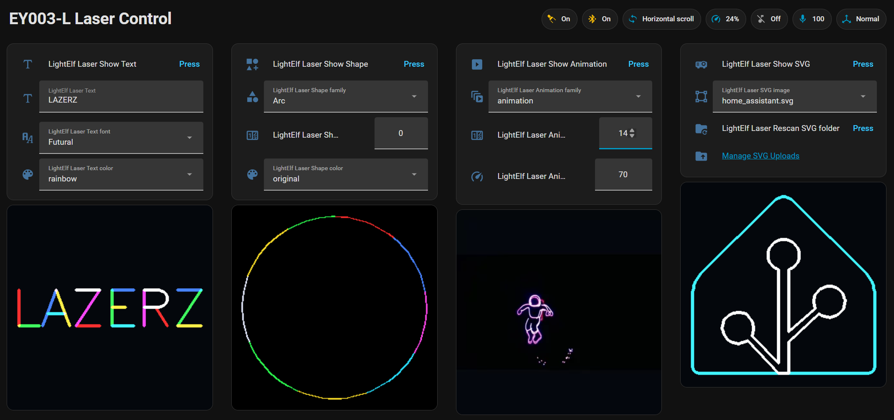

# LightElf Laser

Home Assistant custom integration for LightElf-compatible BLE RGB laser
projectors, such as [this inexpensive example on Amazon](https://amzn.to/4uU93oj) (*affiliate link*).

This integration runs locally through Home Assistant's native Bluetooth stack, no cloud service or mobile app required for setup nor operation.

Control projector power, SVGs, text, built-in shapes, and firmware-native
animations from Home Assistant, with previews before you light the wall.

## Features

- **Local BLE control** with live device-state polling.
- **SVG drawing** with a native Home Assistant upload flow.
- **Vector text** with bundled Hershey fonts, solid colors, or rainbow strokes.
- **Firmware scrolling text** without host-side frame streaming.
- **Built-in static shapes** with live previews.
- **Firmware-native animations** with captured previews.
- **BLE Connection Control** so Home Assistant can release the projector for mobile app access.

## Installation

### HACS custom repository

1. Open HACS in Home Assistant.
2. Add this GitHub repository as a custom repository with category
   **Integration**.
3. Install **LightElf Laser**.
4. Restart Home Assistant.
5. Go to **Settings > Devices & services > Add integration** and choose **LightElf Laser**.

### Manual install

Copy `custom_components/lightelf_laser` into your Home Assistant
`custom_components` directory, restart Home Assistant, then add **LightElf Laser**
from **Settings > Devices & services**.

## Setup Notes

The projector supports one BLE connection at a time. If setup cannot find the
device, disconnect any other BLE controller and try again. Once configured, the
**BLE connection** switch controls whether Home Assistant holds the connection or
releases it.

The integration seeds a few starter SVGs into Home Assistant local media on
first run. Upload your own from
**Settings > Devices & services > LightElf Laser > Configure**; the integration
saves the file, refreshes the SVG picker, and selects it automatically.

## Documentation

- [Usage](docs/USAGE.md)
- [Troubleshooting](docs/TROUBLESHOOTING.md)
- [Protocol notes](docs/PROTOCOL_NOTES.md)
- [Development notes](docs/DEVELOPMENT.md)

## Safety

This controls laser hardware. Aim the projector at a safe projection surface,
avoid eye exposure, and follow the safety instructions for your device.

## License

The integration code is released under the [MIT License](LICENSE).

Bundled Hershey font data is permissively redistributable with acknowledgements;
see [Third-Party Notices](THIRD_PARTY_NOTICES.md) and the bundled
`custom_components/lightelf_laser/fonts/NOTICE.md`.
